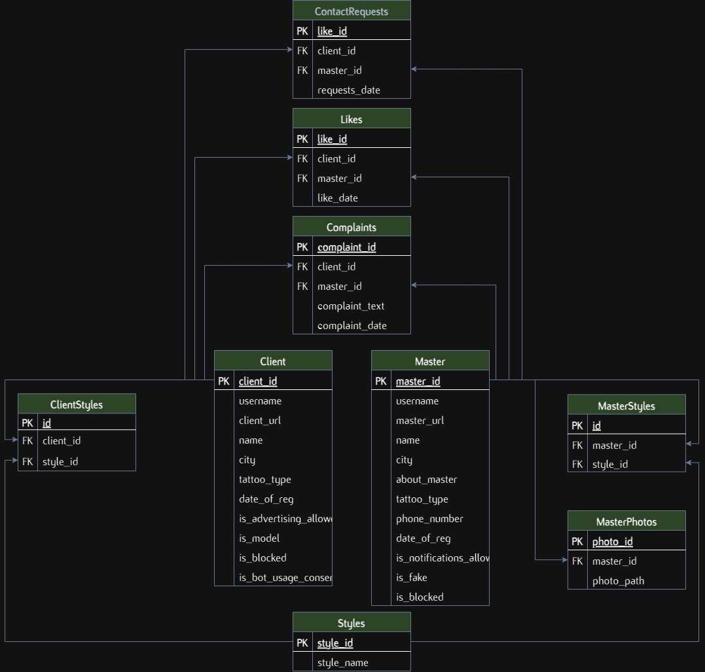

# База данных для поиска тату мастеров и клиентов

## Задача
- Спроектировать и создать методы базы данных для работы с клиентами, мастерами, лайками, жалобами, запросами контактов и стилями тату.

## Результаты
- Создал структуру таблиц БД для хранения профилей мастеров, клиентов, стилей тату, лайков и жалоб.
- Реализовал набор функций для работы с БД, в том числе для поиска анкет мастеров с ранжированием по лайкам и фильтрацией по разным критериям.
- Создал функции по созданию фейковых мастеров, сбору статистики для администраторов.
- Обеспечил обработку ошибок и логирование для облегчения отладки и мониторинга.

## Содержание

- `database/admin_queries.py`: Функции БД для работы с интерфейсом администратора.
- `database/client_queries.py`: Функции БД для работы с клиентом.
- `database/common_queries.py`: Общие функции БД.
- `database/master_queries.py`: Функции БД для работы с мастером.
- `database/db_utils.py`: Функция валидации ID стилей тату.
- `database/models.py`: Определение моделей SQLAlchemy для таблиц базы данных.
- `database/creation.py`: Функции создания и удаления таблиц.
- `database/engine.py`: Настройки для подключения к базе данных с использованием SQLAlchemy.

&nbsp;

  
<b>Схема базы данных</b>

  

## Используемые технологии
- SQLAlchemy
- Asyncio
- PostgreSQL

